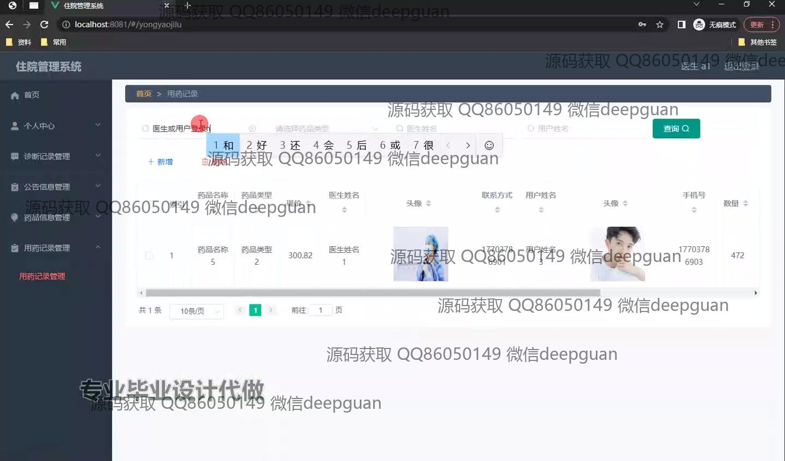

<h1 align="center">基于Java web的住院管理系统+vue</h1>

## 简介
住院管理系统：角色分为管理员、医生、用户；功能涵盖登录、患者信息管理、用药记录管理、公告信息管理、医生管理、诊断记录管理、药品信息管理。    --计算机毕业设计源码；毕设源码；java毕业设计源码

## 联系方式

<h3 align="center">获取完整代码与数据库文件 + 微信：deepguan QQ: 86050149 QQ群: 783742310</h3>

<h3 align="center">可帮忙远程部署 包运行成功！提供远程部署、修改代码、设计文档指导、代码讲解等服务！</h3>

## 功能介绍（完整见运行截图）
管理员：管理员拥有系统的全面访问权限，主要负责管理用户、医生和诊断记录，以及药品信息和公告信息的维护。可以通过左侧的导航栏进入各个管理模块并进行添加、删除或修改操作。同时，管理员可以按照需要查看详细记录，支持按条件搜索，实现系统的高效管理和信息维护。登录系统时需选择角色类型，并可调用附加的安全和个性化服务。

医生：医生可通过系统查看患者的基本信息和历史诊断记录，并进行相应的治疗和诊断。医生还可以添加新诊断、更新现有记录，管理自己的个人信息，以及查询药品的详细信息。系统提供用药记录管理功能，允许医生查看已开具的药品信息，还可删除或新增记录，提高医疗服务的响应速度和准确性。

普通用户：普通用户可注册并登录系统，查看自己的诊断记录和用药信息。同时，用户可以通过系统与医生建立沟通联系，查看医生的详细信息，并按需预约或取消诊疗时间。用户中心提供个人信息的查看与修改功能，并可通过系统了解公告信息，与医院保持有效的沟通和信息互动。

## 运行截图

本代码来源于网络,仅供学习参考使用!

